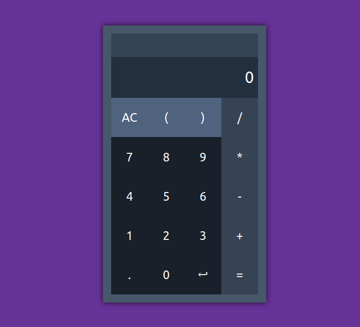

## Calculator ( Javascript )
A simple calculator implementation written for web

 

### Demo link
https://accelerator-one.github.io/calculator-javascript/public/index.html

 

### Screenshot

 

### Other features
- Click on the output screen to *Copy to clipboard*
